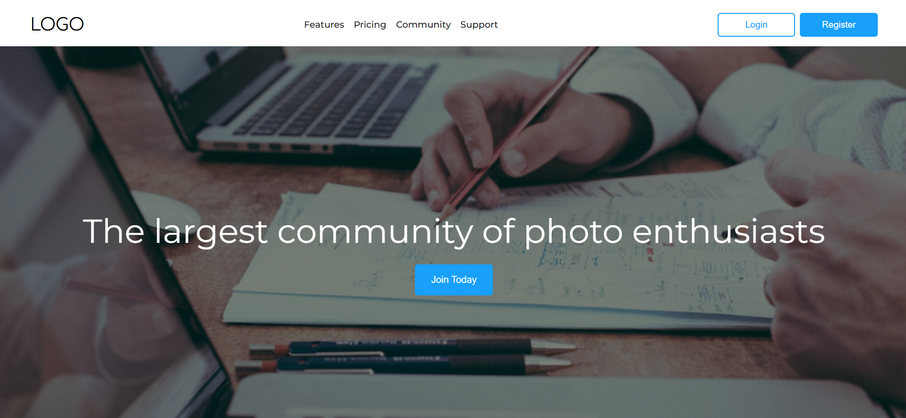

# Landing Page

A community-focused landing page with registration, features, and informational sections.



## Table of Contents

- [Landing Page](#landing-page)
  - [Table of Contents](#table-of-contents)
  - [Features](#features)
  - [Technologies Used](#technologies-used)
  - [Getting Started](#getting-started)
    - [Prerequisites](#prerequisites)
    - [Installation](#installation)
- [Running the Project](#running-the-project)
  - [Project Structure](#project-structure)
  - [Usage](#usage)
  - [Contributing](#contributing)

## Features

- Responsive header with navigation links, logo, and hamburger menu for small screens.
- Sections displaying features and services.
- A registration form with validation for input fields.
- Styled buttons and layout optimized for mobile and desktop views.

## Technologies Used

- HTML5
- CSS3
- JavaScript

## Getting Started

### Prerequisites

Make sure you have a text editor (like VSCode) and a web browser installed.

### Installation

1. Clone the repository:

   ```bash
   git clone https://github.com/probhask/photo-landing.git
   ```

2. Navigate to the project directory:

```bash
 cd epixel-software-assignment
 ```

 # Running the Project

Open the `index.html` file in your browser to view the project.

## Project Structure

- `index.html`: Main HTML file that includes the layout of the project.
- `css/`: Contains the main stylesheet (`styles.css`).
- `assets/`: Stores images and other media used in the project.
- `js/`: JavaScript for handling interactive elements (if needed).

## Usage

- **Header Navigation**: Use the navigation bar links to explore the various sections of the page.
- **Responsive Design**: The layout adjusts to different screen sizes; on small screens, the navbar uses a hamburger menu.
- **Form Submission**: The registration form includes input validation for fields like first name, last name, email, phone, and password.


## Contributing

Feel free to fork the project, create a branch, and make contributions. Pull requests are always welcome.